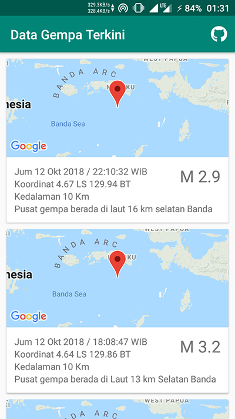

# Data Gempa Terkini
Contoh aplikasi penampang database xml. Data diambil dari http://data.bmkg.go.id



### Library
- Google Maps SDK
- Retrofit (https://square.github.io/retrofit/)
- Simple XML converter for Retrofit (http://simple.sourceforge.net/)

### Model database


Mapingnye sebagai berikut
```java
class DataGempa {

    @Root(name = "point")
    class Point {
        @field:Element(name = "coordinates")
        var coordinates: String? = null
    }

    @Root(name = "Gempa", strict = false)
    class Gempa {
        @field:Element(name = "Dirasakan")
        var dirasakan: String? = null

        @field:Element(name = "point")
        var point: Point? = null

        @field:Element(name = "Magnitude")
        var magnitude: String? = null

        @field:Element(name = "Tanggal")
        var tanggal: String? = null

        @field:Element(name = "Posisi")
        var posisi: String? = null

        @field:Element(name = "Kedalaman")
        var kedalaman: String? = null

        @field:Element(name = "Keterangan")
        var keterangan: String? = null

        @field:Element(name = "_symbol")
        var symbol: String? = null
    }

    @Root
    class Infogempa {
        @field:ElementList(name = "Gempa", inline = true) var gempa: ArrayList<Gempa>? = null
    }

}
```

### Lisensi
[LICENSE](/LICENSE)

### Download
Aplikasi bisa didownload di link berikut
<br>https://play.google.com/store/apps/details?id=com.kucingapes.datagempa

---
Developed by Muhammad Utsman
<br>kucingapes@outlook.com
